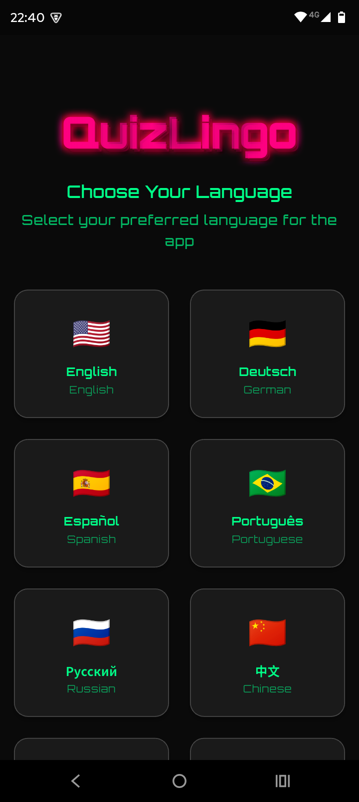
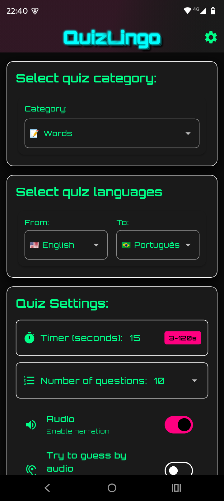
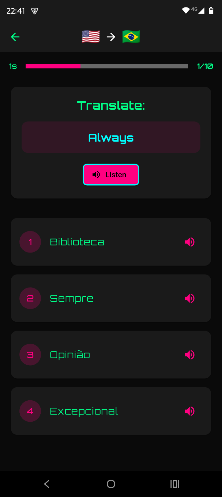
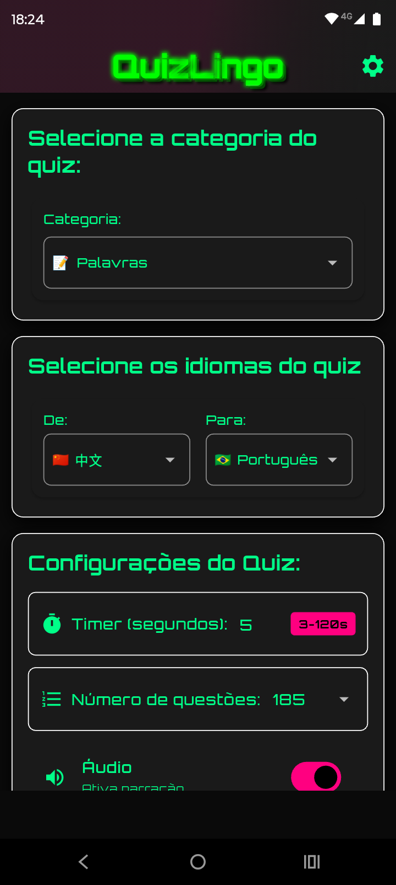

# QuizLingo

Quiz available in 9 languages with audio and a smart mode that also works in the background.

## Download

Get the latest version from [Releases](https://github.com/valentimpalacio/QuizLingo/releases/latest)

## Screenshots

### Language Selection

### Quiz Configuration

### Quiz Gameplay

### Portuguese Mode

